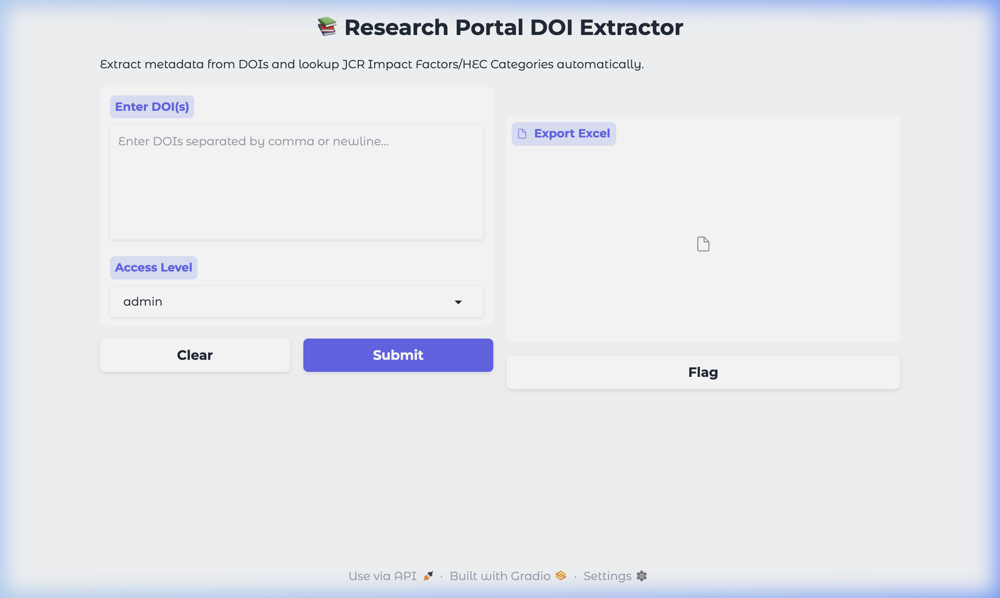

# 📚 Research Metadata Extractor

Automated DOI metadata extraction and JCR Impact Factor lookup tool for academic research portals.


 
## 🌟 Features
- **Multi-Source Extraction**: Fetches metadata from Crossref, OpenAlex, Semantic Scholar, and Unpaywall.
- **Impact Factor Lookup**: Automatically identifies JCR Impact Factors and Quartiles (requires JCR data file).
- **HEC Classification**: Classifies journals into HEC categories (W, X, Y, Z) using the provided national journal list.
- **APA Citation Generator**: Generates formatted APA citations for all extracted DOIs.
- **Web Interface**: User-friendly Gradio UI with role-based access (Admin/User).
- **Excel Export**: Export all fetched metadata to structured Excel files.

## 📁 Project Structure

```text
research-metadata-extractor/
├── data/                       # Input datasets & lookup tables
│   ├── national_journals_2024_25.xlsx  # HEC Journal List
│   └── test_dois.txt           # Sample DOIs for testing
├── docs/                       # Project documentation & visuals
│   └── screenshots/            # UI screenshots
├── output/                     # Exported Excel metadata (auto-generated)
├── src/                        # Core application logic
│   ├── main.py                 # Primary Python script (Gradio UI)
│   └── research_portal_automation.ipynb  # Original Jupyter Notebook
├── .gitignore                  # Git ignore rules
├── CONTRIBUTING.md             # Contribution guidelines
├── LICENSE                     # MIT License
├── README.md                   # Main project documentation
└── requirements.txt            # Python dependencies
```

## 🚀 Getting Started

### Prerequisites
- Python 3.8+
- Required libraries:
```bash
pip install -r requirements.txt
```

### Setup
1. Clone the repository.
2. Place your JCR Impact Factor Excel file in the `data/` folder as `if2025_jcr.xlsx`.
3. The HEC National Journal List is already provided in `data/national_journals_2024_25.xlsx`.

### Usage
Run the main script:
```bash
python src/main.py
```
This will launch a Gradio web interface. Enter your DOIs (one per line or comma-separated) and click "Submit".

## 🛡️ License
This project is licensed under the MIT License - see the [LICENSE](LICENSE) file for details.

## 🤝 Contributing
Contributions are welcome! Please see [CONTRIBUTING.md](CONTRIBUTING.md) for guidelines.


